Headers
# UserInterface -> Layout -> BindablePicker

## Screen 1

### Android

Forms | MAUI | MAUI-p10
:----------:|:---------:
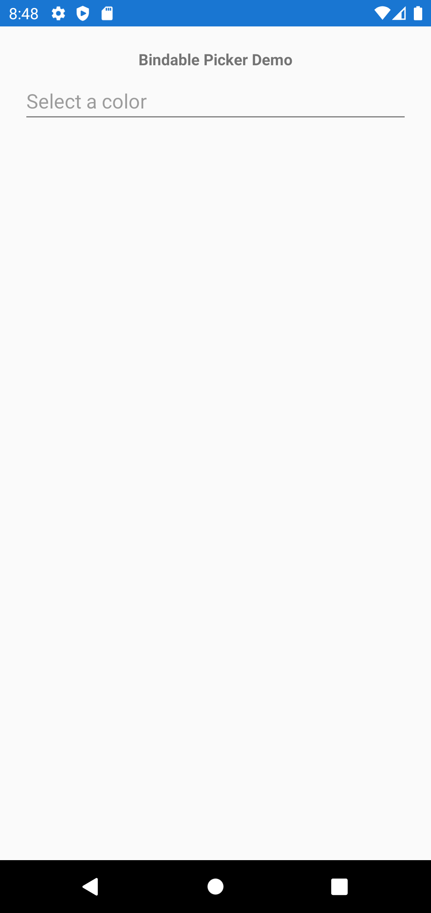 | 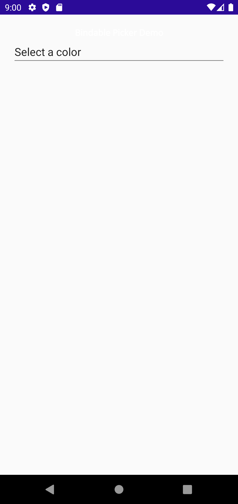 |  

### iOS

Forms |  MAUI
:----------:|:---------:
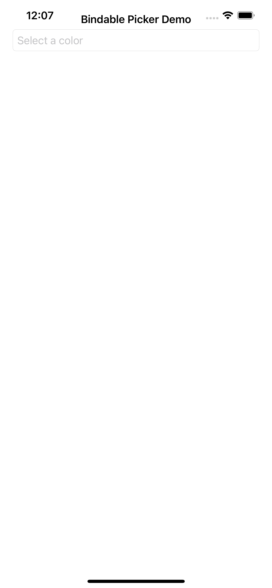 | 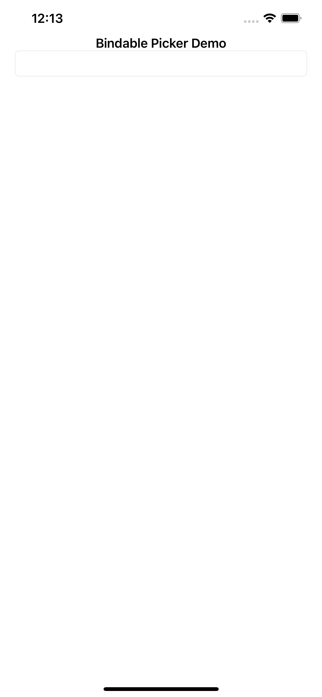

## Screen 2

### Android

Forms |  MAUI
:----------:|:---------:
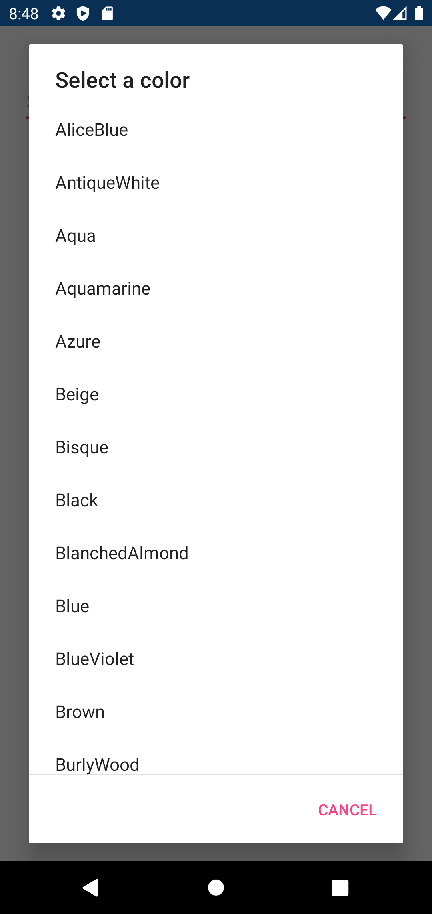 | 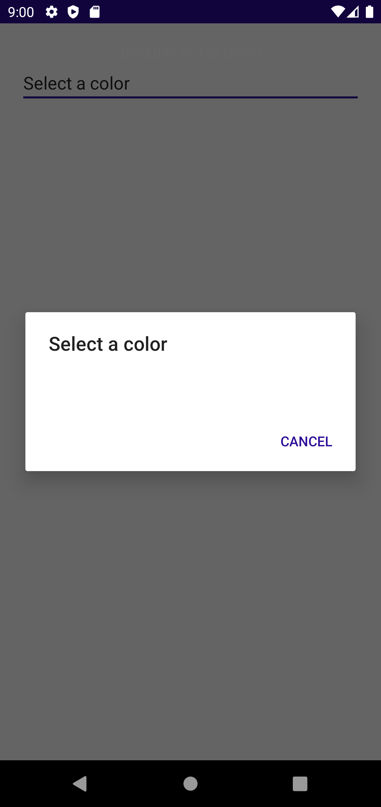 | 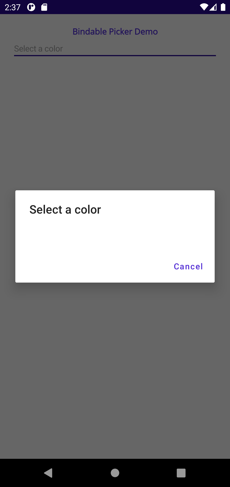

### iOS

Forms |  MAUI
:----------:|:---------:
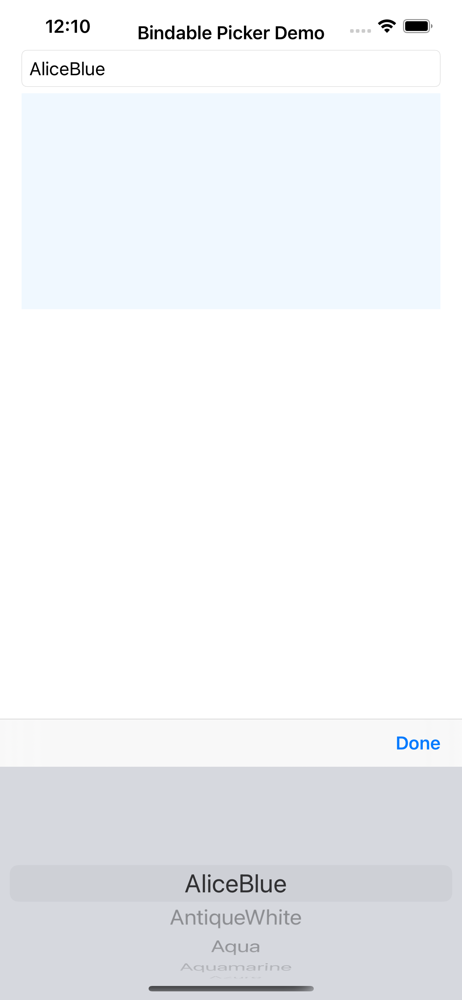 | 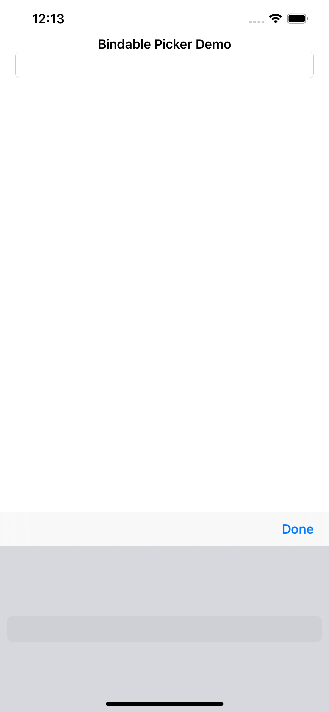

## Screen 3

### Android

Forms |  MAUI
:----------:|:---------:
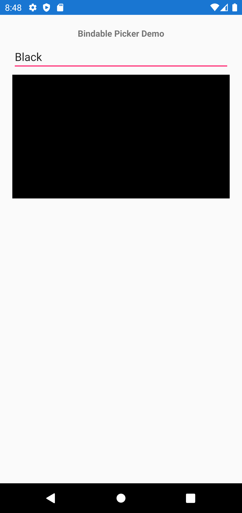 |  | 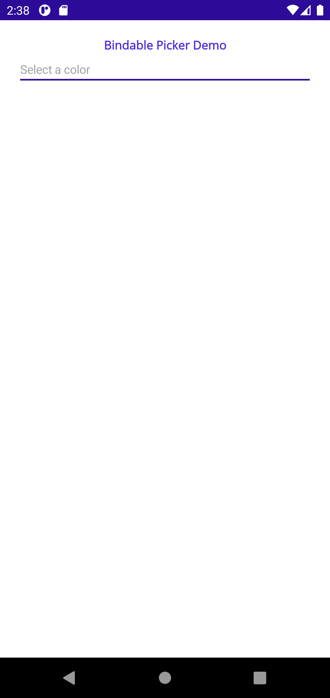

### iOS

Forms |  MAUI
:----------:|:---------:
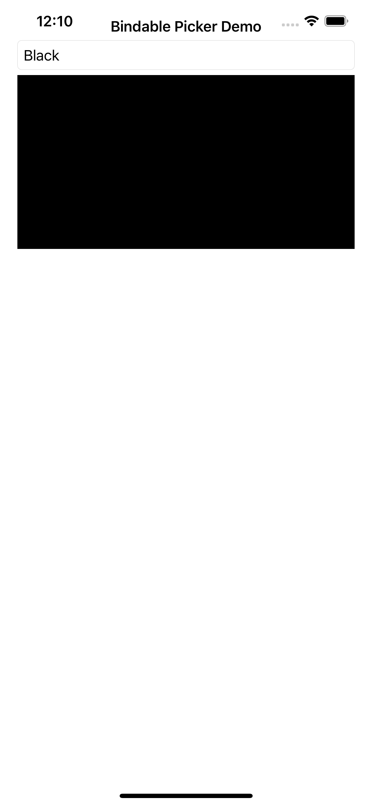 | 

