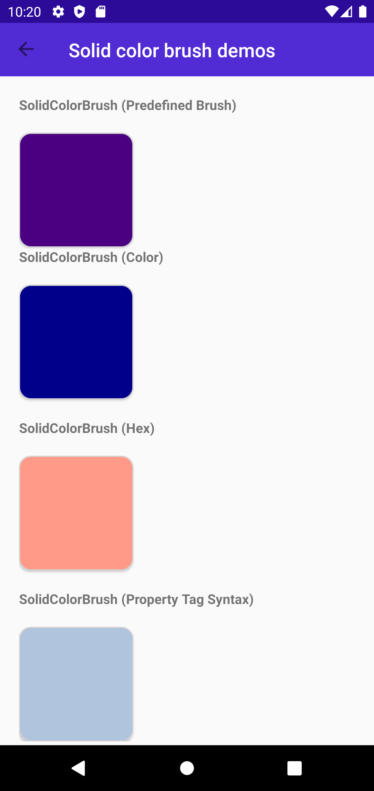

Headers
# UserInterface -> Layout -> BrushDemo

## Screen 1

### Android

Forms | MAUI | MAUI-P10
:----------:|:---------:|:---------:
 |  | 

### iOS

Forms | MAUI | MAUI-P10
:----------:|:---------:|:---------:
 | 

## Screen 2

### Android

Forms | MAUI | MAUI-P10
:----------:|:---------:|:---------:
 |  | 

### iOS

Forms | MAUI | MAUI-P10
:----------:|:---------:|:---------:
 | 

## Screen 3

### Android

Forms | MAUI | MAUI-P10
:----------:|:---------:|:---------:
 |  | 

### iOS

Forms | MAUI | MAUI-P10
:----------:|:---------:|:---------:
 | 

## Screen 4

### Android

Forms | MAUI | MAUI-P10
:----------:|:---------:|:---------:
 |  | 

### iOS

Forms | MAUI | MAUI-P10
:----------:|:---------:|:---------:
 | 

## Screen 5

### Android

Forms | MAUI | MAUI-P10
:----------:|:---------:|:---------:
 |  | 

### iOS

Forms | MAUI | MAUI-P10
:----------:|:---------:|:---------:
 | 

## Screen 6

### Android

Forms | MAUI | MAUI-P10
:----------:|:---------:|:---------:
 | Crashes |  

### iOS

Forms | MAUI | MAUI-P10
:----------:|:---------:|:---------:
 | Crashes

## Screen 7

### Android

Forms | MAUI | MAUI-P10
:----------:|:---------:|:---------:
 |  | 
 --| Layout Pops in after measure | --

### iOS

Forms | MAUI | MAUI-P10
:----------:|:---------:|:---------:
 | 