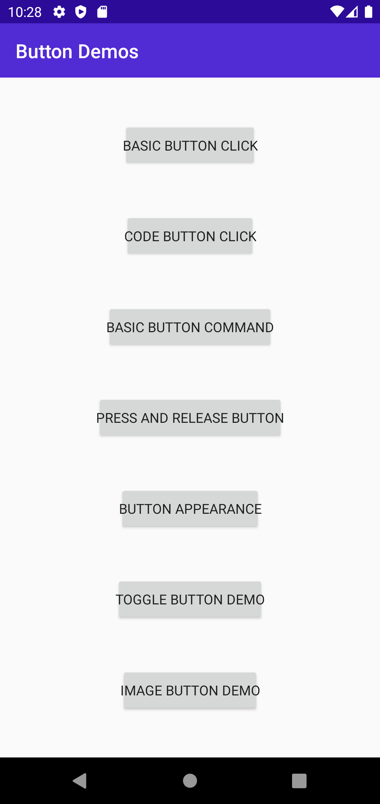
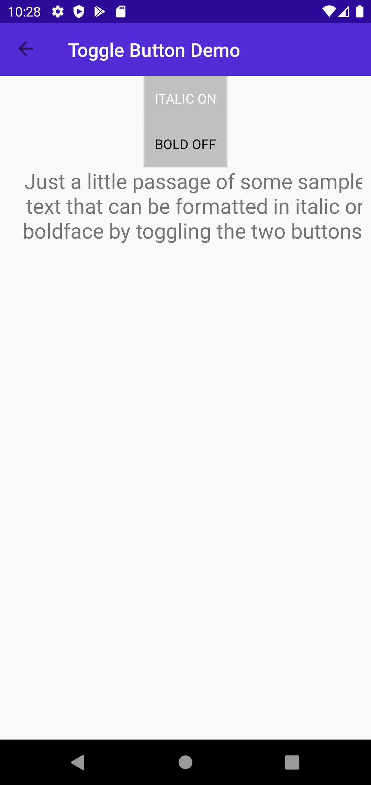
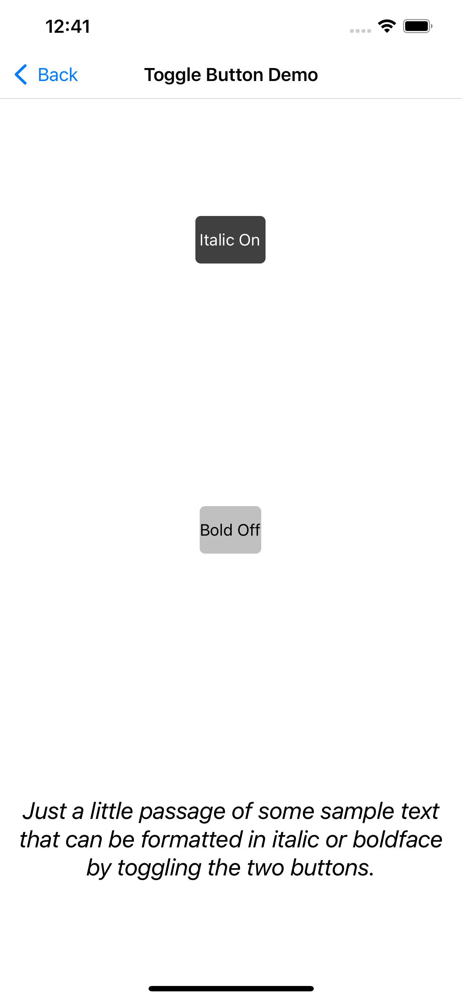

Headers
# UserInterface -> Layout -> ButtonDemo

## Screen 1

### Android

Forms |  MAUI
:----------:|:---------:
 | 

### iOS

Forms |  MAUI
:----------:|:---------:
 | 

## Screen 2

### Android

Forms |  MAUI
:----------:|:---------:
 | 

### iOS

Forms |  MAUI
:----------:|:---------:
 | 

## Screen 3

### Android

Forms |  MAUI
:----------:|:---------:
 | 

### iOS

Forms |  MAUI
:----------:|:---------:
 | 

## Screen 4

### Android

Forms |  MAUI
:----------:|:---------:
 | 

### iOS

Forms |  MAUI
:----------:|:---------:
 | 