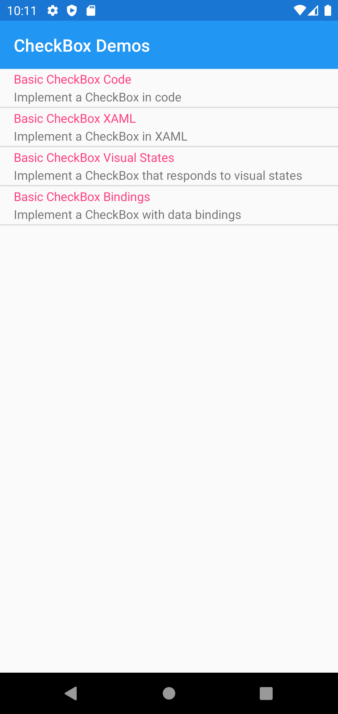
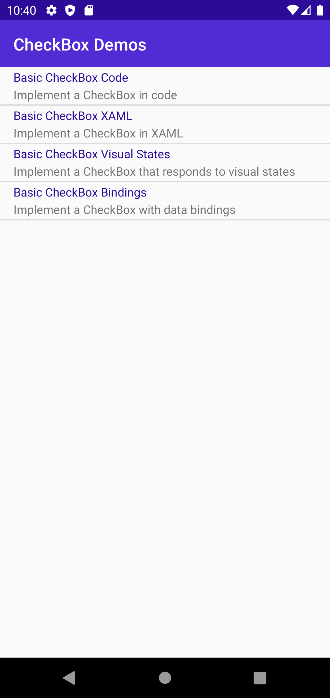
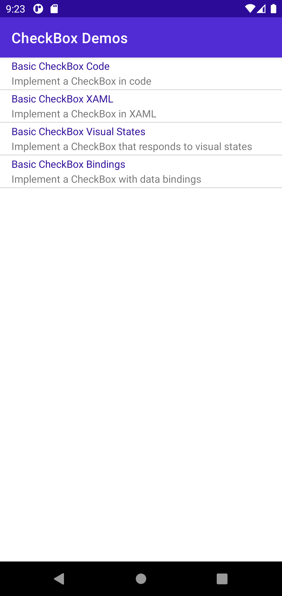
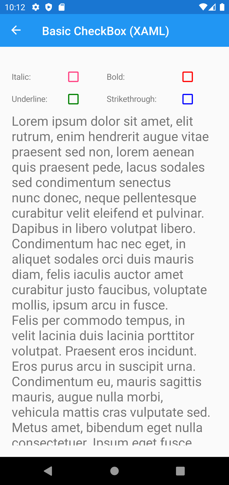
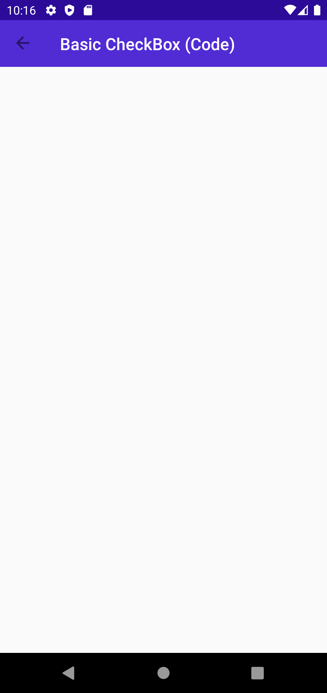
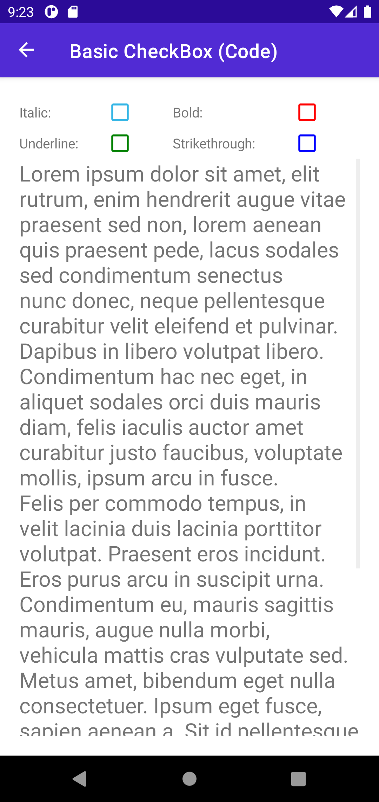
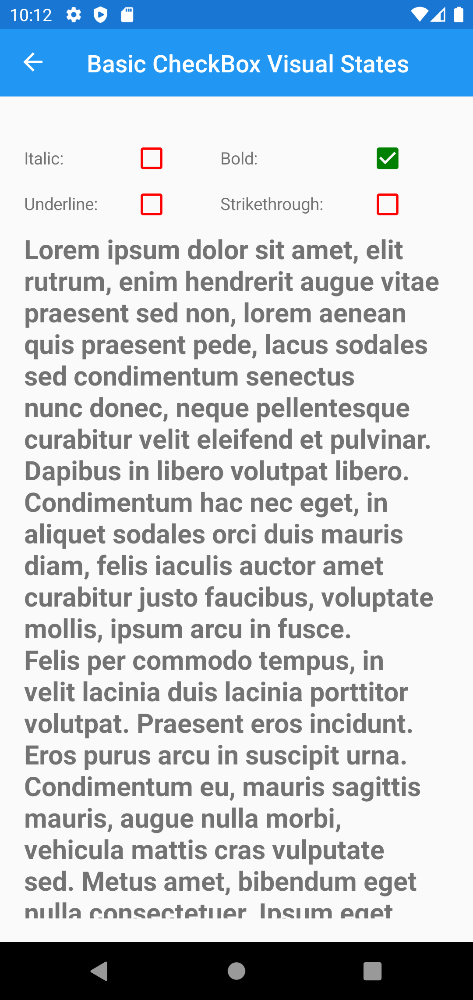
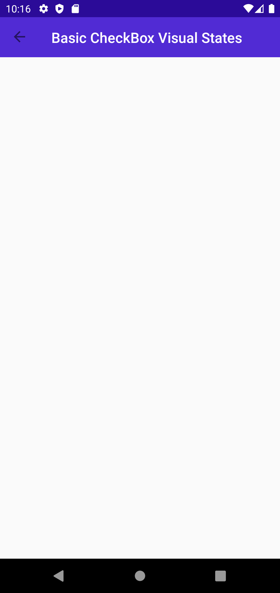
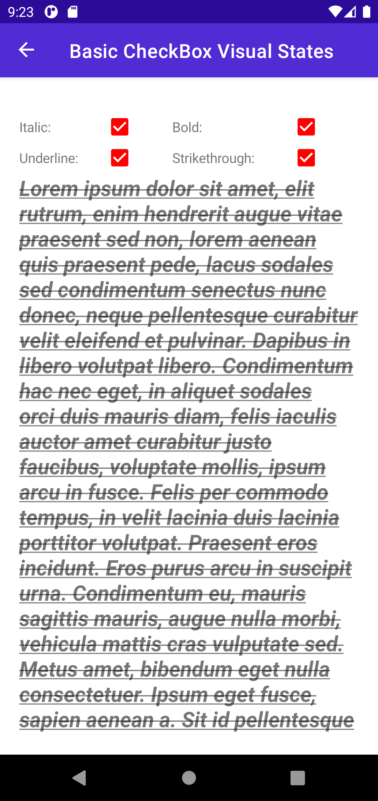

Headers
# UserInterface -> Layout -> CheckBoxDemos

## Screen 1

### Android

Forms | MAUI | MAUI-P10
:----------:|:---------:|:---------:
 |  | 

### iOS

Forms | MAUI | MAUI-P10
:----------:|:---------:|:---------:
TBD | TBD

## Screen 2

### Android

Forms | MAUI | MAUI-P10
:----------:|:---------:|:---------:
 |  | 

### iOS

Forms | MAUI | MAUI-P10
:----------:|:---------:|:---------:
TBD | TBD

## Screen 3

### Android

Forms | MAUI | MAUI-P10
:----------:|:---------:|:---------:
 |  | 

### iOS

Forms | MAUI | MAUI-P10
:----------:|:---------:|:---------:
TBD | TBD