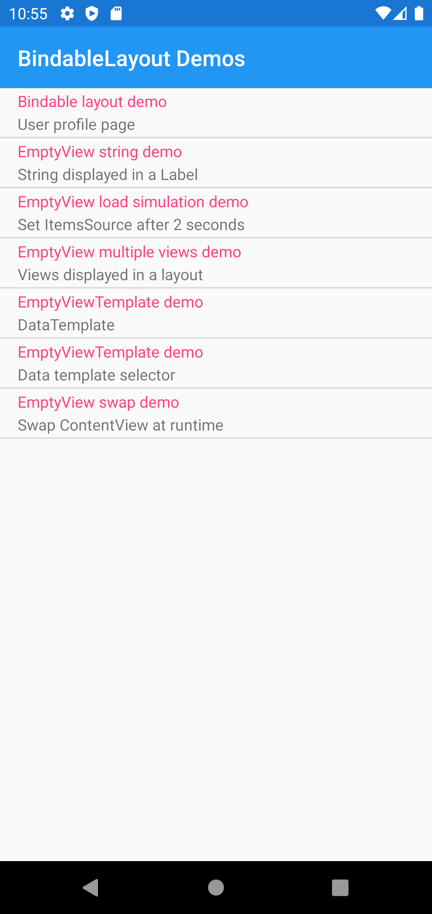
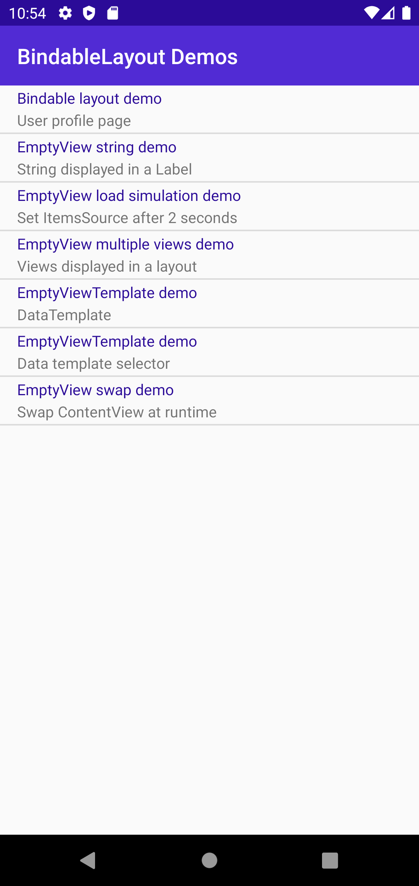
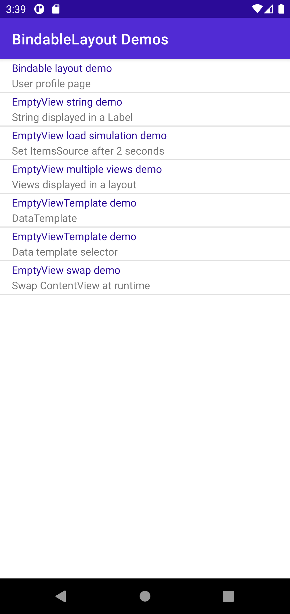

Headers
# UserInterface -> Layout -> BindableLaytoutsDemo

## Screen 1

### Android

Forms | MAUI | MAUI-P10
:----------:|:---------:|:---------:
 |  | 

### iOS

Forms | MAUI | MAUI-P10
:----------:|:---------:|:---------:
TBD | TBD

## Screen 2

### Android

Forms | MAUI | MAUI-P10
:----------:|:---------:|:---------:
 | Crashes |  
N/A | Crashes | Crashes when LayoutBounds contains AutoSize. This needs to be commented out: AbsoluteLayout.LayoutBounds="1, 0, AutoSize, AutoSize"

### iOS

Forms | MAUI | MAUI-P10
:----------:|:---------:|:---------:
TBD | TBD

