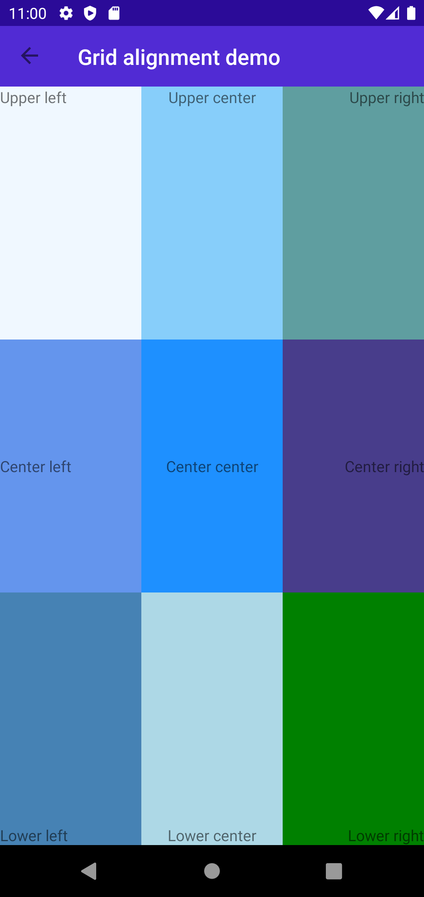

Headers
# UserInterface -> Layout -> GridDemos

_Forms on the left, MAUI on the right_

## Home Screen

### Android

### iOS

## XAML Rows and Columns

### Android

### iOS

## XAML Row Spacing and Column Spacing

### Android

### iOS

## XAML Simplified Rows and Columns

### Android

### iOS

## XAML Horizontal and Vertical Options

### Android

### iOS

## XAML Nested Grid

### Android

### iOS

## XAML Calculator

### Android

### iOS

