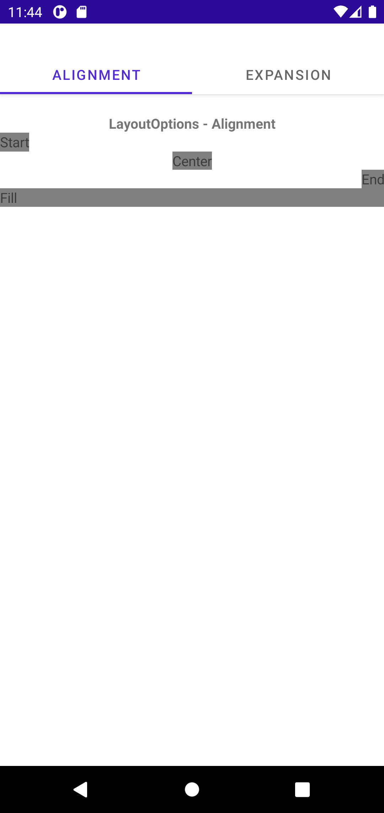
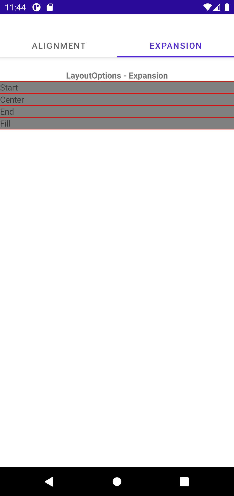

Headers
# UserInterface -> Layout -> LayoutOptions

## Screen 1

### Android

Forms| MAUI | MAUI-P10
:----------:|:---------:|:---------:
 |  | 

### iOS

Forms| MAUI | MAUI-P10
:----------:|:---------:|:---------:
TBD | TBD | TBD

## Screen 2

### Android

Forms| MAUI | MAUI-P10
:----------:|:---------:|:---------:
 |  | 

### iOS

Forms| MAUI | MAUI-P10
:----------:|:---------:|:---------:
TBD | TBD | TBD
