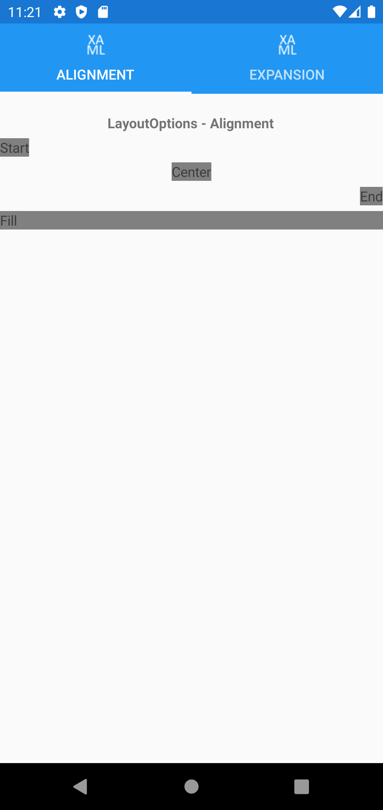
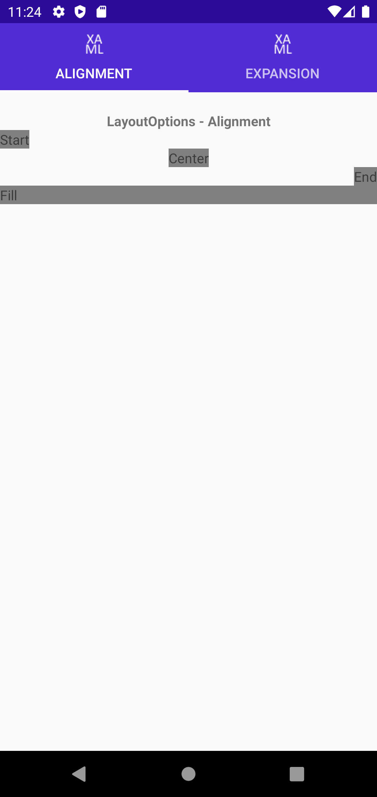
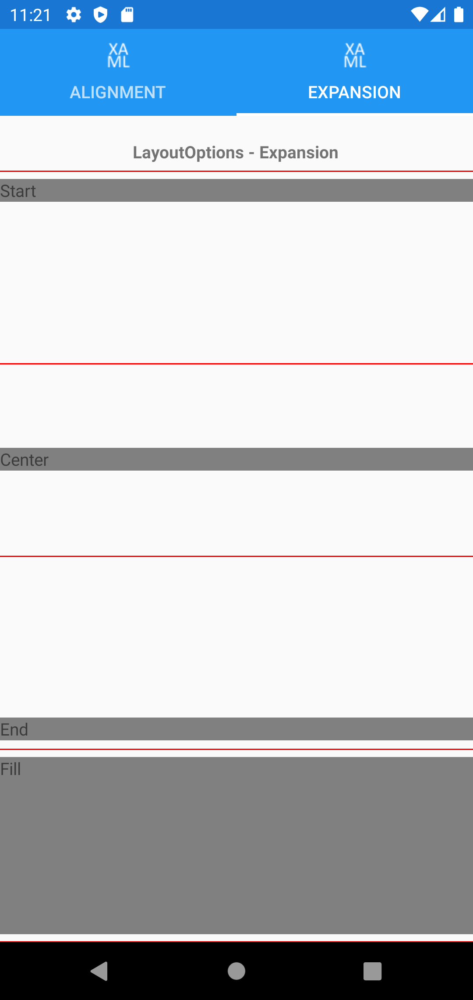
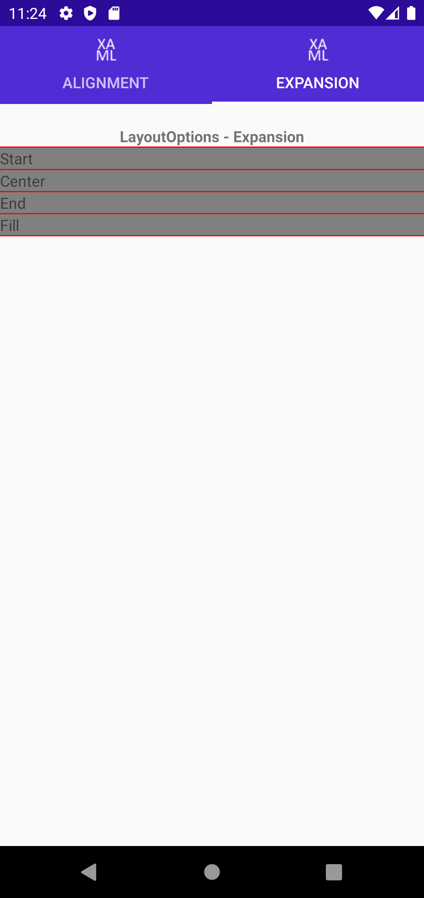

Headers
# UserInterface -> Layout -> LayoutOptions

## Screen 1

### Android

Forms |  MAUI
:----------:|:---------:
 | 

### iOS

Forms |  MAUI
:----------:|:---------:
TBD | TBD

## Screen 2

### Android

Forms |  MAUI
:----------:|:---------:
 | 

### iOS

Forms |  MAUI
:----------:|:---------:
TBD | TBD
