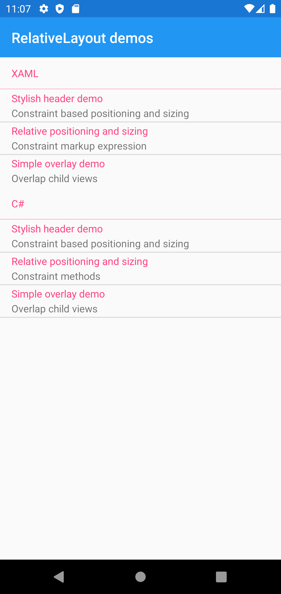
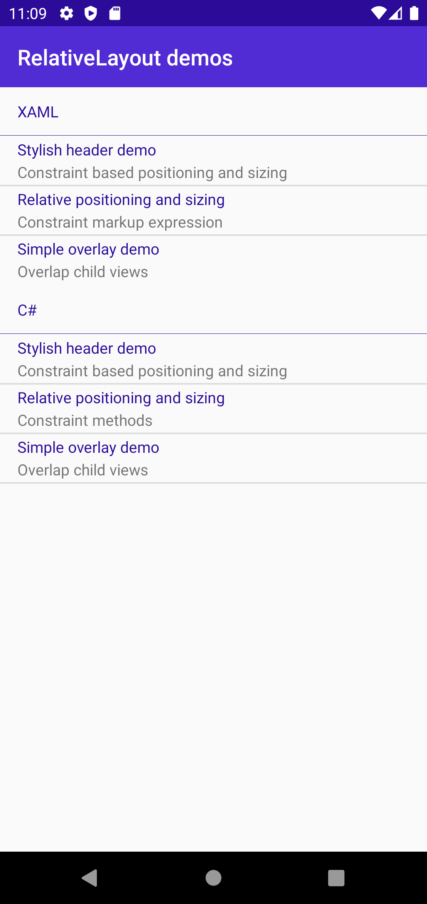
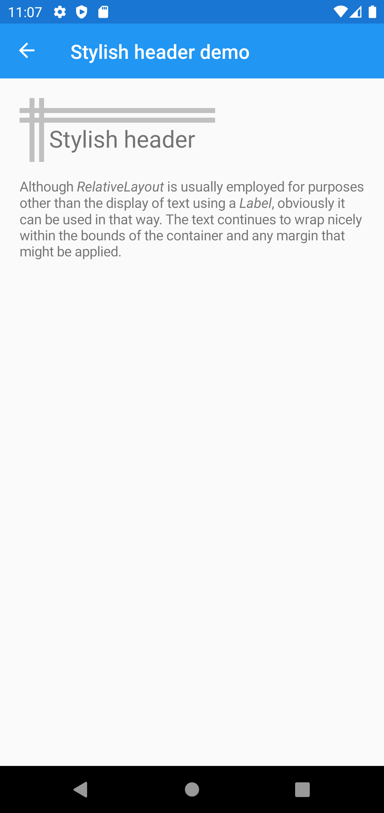
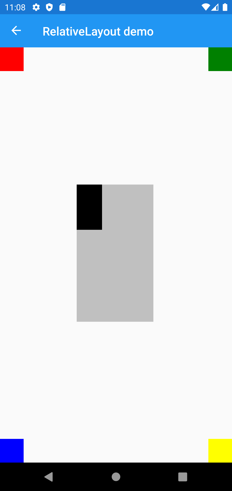
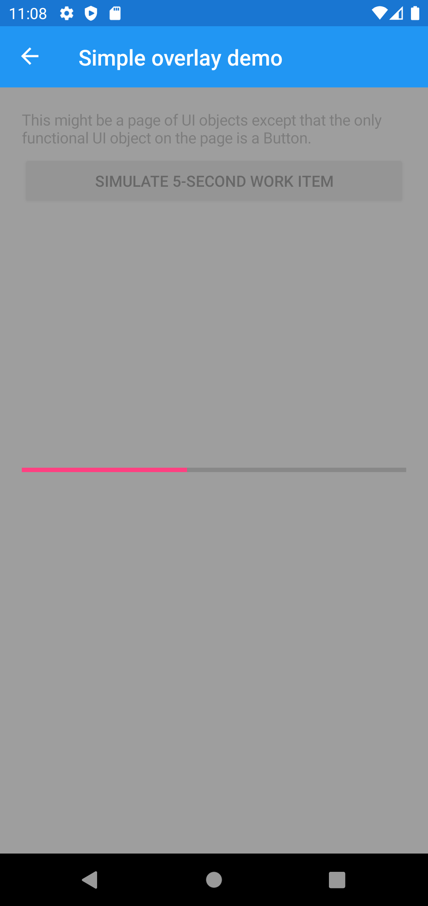

Headers
# UserInterface -> Layout -> RelativeLayoutDemos

## Screen 1

### Android

Forms |  MAUI
:----------:|:---------:
 | 

### iOS

Forms |  MAUI
:----------:|:---------:
TBD | TBD

## Screen 2

### Android

Forms |  MAUI
:----------:|:---------:
 | Crashes

### iOS

Forms |  MAUI
:----------:|:---------:
TBD | TBD

## Screen 3

### Android

Forms |  MAUI
:----------:|:---------:
 | Crashes

### iOS

Forms |  MAUI
:----------:|:---------:
TBD | TBD

## Screen 4

### Android

Forms |  MAUI
:----------:|:---------:
 | Crashes

### iOS

Forms |  MAUI
:----------:|:---------:
TBD | TBD
